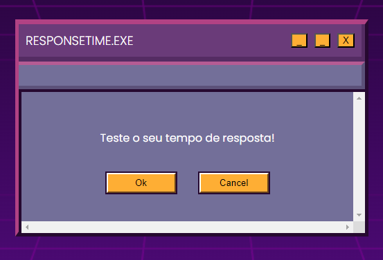
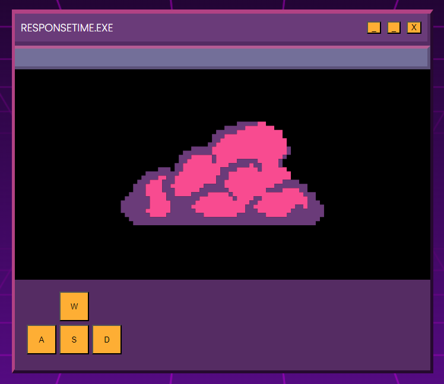

# Minegame de Tempo de Resposta

Bem-vindo ao Minegame de Tempo de Resposta! Aqui, você pode testar seus reflexos enquanto se diverte com cores e nuvens. ☁️

Este projeto foi desenvolvido como uma atividade prática da disciplina de Sistemas de Tempo Real, e fico feliz em compartilhar esta experiência de aprendizado e entretenimento com você. 🎮🚀

## Como Jogar
1. Acesse o jogo através do deploy [aqui](https://responsetime.netlify.app).
2. Aguarde o carregamento e esteja preparado para reagir às nuvens coloridas que aparecerão na tela.
3. Pressione rapidamente a tecla correspondente à cor da nuvem antes que ela desapareça.
4. Desafie seus amigos e veja quem consegue os melhores tempos de reação!

## Funcionalidades do Jogo
- **Apresentação das imagens:** Nuvens coloridas são exibidas na tela para testar seus sentidos.
- **Resposta do usuário:** Teste seus reflexos pressionando as teclas corretas no momento certo.
- **Cálculo do tempo de resposta:** Descubra seu tempo de reação e acompanhe seu desempenho.
- **Vídeo Explicativo:** Assista a um vídeo explicativo sobre o jogo [aqui](https://www.loom.com/share/f543f0a753da4ce0a5e67d64ffb74271?sid=34127f4c-109e-416b-9cd1-2dd8740af46d).

## Explorando o Repositório
- **mainView:** View de start.
- **gameView:** Tela de exposição das nuvens.

## Sneak Peek do Jogo
| Interface Inicial | Exemplo das Nuvens |
|---|---|
|  |  |
| *Figura 1: Interface de start do jogo.* | *Figura 2: Exemplo das nuvens durante o jogo.* |

## Contribuições São Bem-Vindas!
Gostaria de contribuir para tornar o jogo ainda melhor? Abra uma issue para relatar problemas, sugerir melhorias ou contribuir diretamente para o código. Juntos, podemos aprimorar esta experiência!

Divirta-se e boa sorte no desafio do Minegame de Tempo de Resposta! 🚀✨
